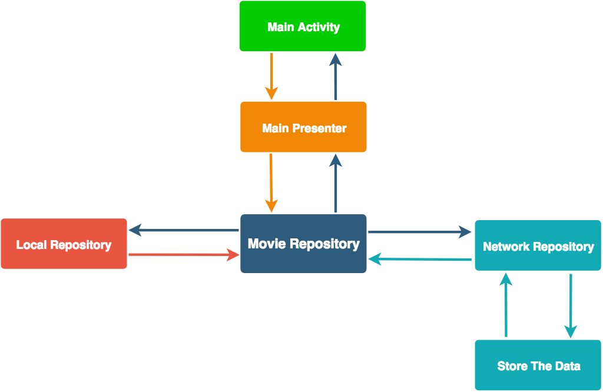

# Sample Movie App [](https://travis-ci.org/hmedat2008/SampleMovieApp.svg?branch=master)
This app shows Latest Movies and their details  
Detail page is displayed with poster, title, trailer

## Architecture
The Application implemented and structured bases on the MVP pattern best practice
Whole application functionality is implemented in pure Kotlin
Layers communications are managed by RxJava & RxAndroid contributed by ReactiveX.
Sample test cases are implemented by mockito

## Libraries and SDKs Used
- [Kotlin](https://developer.android.com/kotlin/index.html)
- [Android Support Libraries](https://developer.android.com/topic/libraries/support-library/packages.html) 
- [RxJava + RxAndroid](https://github.com/ReactiveX/RxJava)
- [Room](https://developer.android.com/topic/libraries/architecture/room)
- [Dagger](https://github.com/google/dagger)
- [Mockito](https://github.com/mockito/mockito)
- [Retrofit](http://square.github.io/retrofit/)
- [Gson](https://github.com/google/gson)
- [Glide](https://github.com/bumptech/glide)
- [BaseRecyclerViewAdapterHelper](https://github.com/CymChad/BaseRecyclerViewAdapterHelper)
- [Empty View](https://github.com/santalu/emptyview)
- [Android YouTube Player](https://github.com/PierfrancescoSoffritti/Android-YouTube-Player)
- [Detekt](https://github.com/arturbosch/detekt)
- [Ktlint](https://github.com/shyiko/ktlint)


## How To Use it
In your gradle.properties file add your API key, and you can generate it from [here](https://developers.themoviedb.org/4/getting-started)
```
MovieAPIKey = "Your API Key"
```


## Screenshots

<table>
  <tr>
    <td>
     
   |  | 
   |:--:| 
   | *Normal Behaviour* |
   
   </td>
    <td>
 
   |  | 
   |:--:| 
   | *Offline Behaviour* |
    
  </tr>
</table>

## Main Activity Flow


## License

* [Apache Version 2.0](http://www.apache.org/licenses/LICENSE-2.0.html)
Copyright 2018 Mohammed hmedat

```
Licensed under the Apache License, Version 2.0 (the "License");
you may not use this file except in compliance with the License.
You may obtain a copy of the License at

 http://www.apache.org/licenses/LICENSE-2.0

Unless required by applicable law or agreed to in writing, software
distributed under the License is distributed on an "AS IS" BASIS,
WITHOUT WARRANTIES OR CONDITIONS OF ANY KIND, either express or implied.
See the License for the specific language governing permissions and
limitations under the License.
```
